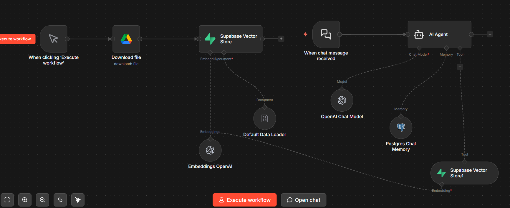

# 🤖 Retrieval-Augmented Generation (RAG) Agent
An AI-powered **RAG (Retrieval-Augmented Generation) Agent** built using **n8n**, integrating **OpenAI**, **Supabase (pgvector)**, and **PostgreSQL** to deliver accurate, context-aware responses from external knowledge sources.
## 🚀 Overview
This project implements an end-to-end **RAG pipeline** that enhances Large Language Model (LLM) responses by retrieving relevant context from a vector database.
Instead of relying only on model memory, the system:
- Retrieves semantically relevant documents  
- Injects them into the prompt  
- Generates more accurate and grounded responses  
## 🧩 Architecture
### 🔄 Workflow Overview

### 🧠 Pipeline Flow

User Query → Embeddings → Vector Search → Context Retrieval → LLM → Response

## 🛠️ Tech Stack
- **Workflow Automation:** n8n  
- **LLM & Embeddings:** OpenAI API  
- **Vector Database:** Supabase (pgvector)  
- **Memory Storage:** PostgreSQL  
- **Data Handling:** Custom ingestion pipelines  
## ⚙️ Features
- 🔍 Semantic search using vector embeddings  
- 📄 Automated document ingestion & chunking  
- 🧠 Context-aware response generation (RAG)  
- 💬 Multi-turn conversation with memory  
- 🔄 End-to-end workflow automation using n8n  
## 📂 How It Works
1. **Data Ingestion**
   - Documents are uploaded and split into chunks  
   - Embeddings are generated using OpenAI  
2. **Storage**
   - Embeddings stored in Supabase vector database  
3. **Query Processing**
   - User query converted into embedding  
   - Relevant documents retrieved via similarity search  
4. **Response Generation**
   - Retrieved context + query sent to LLM  
   - Final response generated  
## ⚙️ Setup & Usage
1. Clone the repository:
## 🛠️ Tech Stack
- **Workflow Automation:** n8n  
- **LLM & Embeddings:** OpenAI API  
- **Vector Database:** Supabase (pgvector)  
- **Memory Storage:** PostgreSQL  
- **Data Handling:** Custom ingestion pipelines  
## ⚙️ Features
- 🔍 Semantic search using vector embeddings  
- 📄 Automated document ingestion & chunking  
- 🧠 Context-aware response generation (RAG)  
- 💬 Multi-turn conversation with memory  
- 🔄 End-to-end workflow automation using n8n  
## 📂 How It Works

1. **Data Ingestion**
   - Documents are uploaded and split into chunks  
   - Embeddings are generated using OpenAI  
2. **Storage**
   - Embeddings stored in Supabase vector database  
3. **Query Processing**
   - User query converted into embedding  
   - Relevant documents retrieved via similarity search  
4. **Response Generation**
   - Retrieved context + query sent to LLM  
   - Final response generated  
## ⚙️ Setup & Usage
1. Clone the repository:

git clone https://github.com/Erico-Marak/RAG-Agent.git

2. Import the workflow into n8n:

Rag Agent.json

3. Configure environment:
- OpenAI API Key  
- Supabase credentials  
- PostgreSQL connection  
4. Run the workflow in n8n  
## 📌 Use Cases
- AI-powered document Q&A  
- Knowledge base assistants  
- Chatbots with memory  
- Internal enterprise search systems  
## 🚧 Future Improvements
- Add frontend UI for interaction  
- Improve retrieval with hybrid search  
- Support multiple data sources  
- Optimize latency and scalability  

